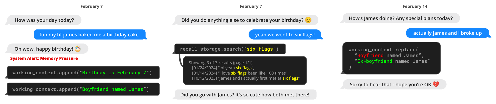
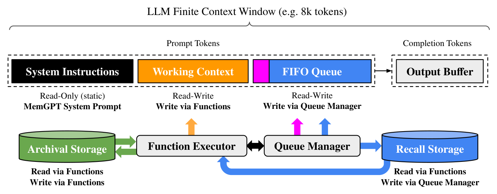

# MemGPT 论文总结（Abstract + Introduction）

> 来源：arXiv:2310.08560v2

## 一、核心问题

大语言模型（LLM）受限于**固定长度的上下文窗口**，在长对话、长文档分析等任务中表现受限：

- 主流开源 LLM 通常只能处理几十轮对话或一篇短文档，超过最大输入长度后便失效。
- 直接扩展 Transformer 上下文长度会因自注意力机制带来**计算与显存的平方级增长**。
- 即便训练出更长上下文的模型，研究也表明它们**难以有效利用额外上下文**（"lost in the middle" 现象）。
- 训练 SOTA LLM 资源巨大，上下文扩展收益递减，亟需替代方案。

## 二、核心思想：虚拟上下文管理（Virtual Context Management）

论文借鉴**操作系统的虚拟内存分页机制**：OS 通过在物理内存与磁盘之间换页，给应用"无限内存"的错觉。

类比映射：

| 操作系统 | MemGPT |
| --- | --- |
| 物理内存（main memory） | LLM 上下文窗口（main context） |
| 磁盘 / 外部存储 | 外部存储（archival & recall storage） |
| 分页、缺页中断 | 函数调用驱动的数据换入换出 |
| 进程与系统调用 | LLM agent 与函数调用 |

通过这种层次化记忆设计，让**固定上下文**的 LLM 也能获得"无限上下文"的使用体验。

*图 1：MemGPT 收到上下文空间不足的系统告警后，将数据写入持久化记忆。*

## 三、MemGPT 系统设计要点

1. **LLM OS 架构**：把 LLM 当作 CPU，外层包裹一个类 OS 的调度器，统一管理上下文、存储、事件。
2. **分层记忆（Memory Hierarchy）**：
   - *Main context*：系统指令 + working context + FIFO 队列，即 LLM 真正看到的 prompt。
   - *External context*：archival storage（归档）和 recall storage（检索历史），位于上下文窗口之外。
3. **函数调用作为"系统调用"**：LLM 通过生成函数调用来读写外部存储、修改自身上下文、决定是否回复用户。
4. **事件驱动的控制流**：上下文快满时收到系统告警，触发写入持久化记忆；需要旧信息时主动检索换入。
5. **函数链（Function Chaining）**：LLM 在输出中附带 `request_heartbeat=true`，即可触发下一轮推理，从而完成**多步检索 / 多步推理**。

> 示意：Figure 1 展示上下文不足时写入持久记忆；Figure 2 展示检索外部数据换入上下文；Figure 3 给出完整系统流程。

*图 2：MemGPT 可以搜索上下文外的数据，把相关信息换入当前上下文窗口。*

*图 3：固定上下文的 LLM 处理器被分层记忆系统与一组"系统调用"函数扩展。main context = 系统指令 + working context + FIFO 队列；LLM 输出被 function executor 解析为函数调用，在 main context 与 external context（archival / recall 存储）之间搬运数据；`request_heartbeat=true` 触发链式调用以完成多步检索。*

## 四、评估场景

论文在两个典型的"上下文瓶颈"场景上验证 MemGPT：

1. **文档分析**：处理**远超 LLM 上下文长度**的大型文档。
2. **多轮会话 / 对话 agent**：在长时间交互中保持**上下文感知、人设一致性、长期记忆**，能够记住、反思并动态演化。

在两个场景下，MemGPT 都**超越了现有基于 LLM 的方法**。

## 五、关键贡献

- 提出 **虚拟上下文管理** 这一 OS 启发的 LLM 记忆管理范式。
- 实现 MemGPT 系统：分层存储 + 函数调用 + 事件驱动控制流，让有限上下文 LLM 处理无限上下文任务。
- 在文档分析与长期对话两个 benchmark 上验证有效性。
- **开源代码与实验数据**。

## 六、一句话概括

> **MemGPT 把 LLM 的上下文窗口当作"物理内存"，用函数调用当作"系统调用"，在外部存储与上下文之间自主分页，从而让固定窗口的 LLM 处理近乎无限长度的文档与对话。**
