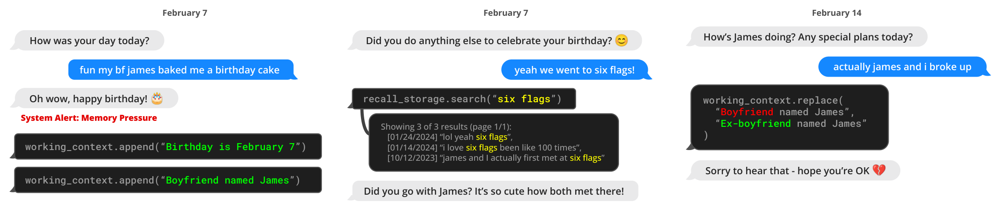

# MemGPT 论文总结（Method / 方法章节）

> 来源：arXiv:2310.08560v2

## 一、总体思路：OS 风格的多级记忆架构

MemGPT 借鉴操作系统的存储层次，把 LLM 的记忆切分成两类：

| 记忆类型 | OS 类比 | 含义 |
| --- | --- | --- |
| **Main context**（主上下文） | 主存 / RAM | LLM 的 **prompt tokens**，*in-context*，可直接被 LLM 在推理时访问 |
| **External context**（外部上下文） | 磁盘 / 外存 | 位于 LLM 固定上下文窗口之外的 *out-of-context* 数据，必须**显式搬入** main context 才能被 LLM 看到 |

关键点：MemGPT 通过**函数调用**让 LLM 在**没有用户介入**的情况下自主管理自己的记忆。

## 二、Main Context：prompt tokens 的三段结构

main context 是一段连续的 prompt，由三块组成：

1. **System instructions（系统指令）**：只读、静态；包含
   - MemGPT 的控制流说明
   - 各级记忆的用途
   - 所有可用函数的用法（如何检索 out-of-context 数据等）
2. **Working context（工作上下文）**：定长、可读写，**仅能通过 MemGPT 函数调用修改**。
   - 在对话场景下用来保存用户关键事实、偏好、以及 agent 当前所扮演人设的核心信息，使对话更连贯。
3. **FIFO queue（先进先出队列）**：滚动的消息历史，包含
   - agent ↔ 用户消息
   - 系统消息（如记忆压力告警）
   - 函数调用的输入/输出
   - **队首第一个位置**专门放一条系统消息：对已被 evict 出队列的历史消息的**递归摘要（recursive summary）**。

## 三、Queue Manager：消息入队、落盘与淘汰

Queue Manager 负责管理 **recall storage**（MemGPT 消息数据库）和 **FIFO queue**。

### 正常消息流
1. 收到新消息 → 追加到 FIFO queue 尾部
2. 拼接 prompt tokens，触发 LLM 推理，产出 completion tokens
3. 把**用户消息**与**LLM 输出**都写入 recall storage
4. 当通过函数调用从 recall storage 检索出旧消息时，把它们追加到**队尾**，重新进入 LLM 可见的上下文

### 溢出控制：两级阈值触发
| 阈值 | 触发条件（示例） | 系统行为 |
| --- | --- | --- |
| **Warning token count** | prompt tokens 达到上下文窗口的 ~70% | 向队列注入一条"记忆压力告警"系统消息，提示 LLM 用函数把 FIFO 队列中的重要内容**转写到 working context 或 archival storage** |
| **Flush token count** | prompt tokens 达到上下文窗口的 ~100% | **flush 队列**：按固定比例（如 50%）驱逐最早的消息；用已有递归摘要 + 新驱逐的消息，生成新的递归摘要 |

被 evict 的消息虽然**不再 in-context**，但会**永久保留在 recall storage** 中，随时可通过函数调用读回。

#### 易误解点：warning ≠ 压缩，为什么还会触发 flush？

warning 阶段**不会动 FIFO 队列里的任何消息**，它只是：
- 在队列尾部**追加**一条 `[SYSTEM] memory pressure` 文本（反而让 prompt 更长）
- 等待 LLM**自主决策**是否调用 `archival_storage.insert` / `working_context.append`
- 即便 LLM 真的调了，这些函数也是**把内容复制**到外部/working 区，FIFO 队列一条都不会少

所以 prompt tokens 会继续上涨，至少 4 条路径会推动它到 100%：
1. **LLM 判断没必要存**，忽略 warning 继续聊
2. **写入 working context** —— 外部没占，但 prompt 内部反而更挤
3. **归档 ≠ 出队** —— 复制到 archival，FIFO 里原文还在
4. **新消息持续涌入** —— 用户消息、事件、函数 I/O 都在追加

一句话：**warning 提醒你"备份"，flush 才是强制"清理"。** 备份再勤，实际占位的那堆消息也要靠 flush 让位。这和 OS 里 "dirty page 先写盘 → 内存吃紧时才回收页框" 完全对应。

> **Archival storage**（归档存储）：读写数据库，存任意长度的文本对象，LLM 可通过函数调用主动写入与查询。详见下一节。

## 三·B、Archival Storage vs Recall Storage

两者都属于 external context（在 LLM 上下文窗口之外），但**职责、谁写、典型后端**都不同。

| 维度 | Archival Storage（归档） | Recall Storage（召回） |
| --- | --- | --- |
| 存什么 | 任意长度文本对象：长文档、简历、知识库、LLM 主动提炼的要点 | **完整对话消息流水**（user / agent / system / 函数 I/O） |
| 谁写入 | **LLM 主动**调 `archival_storage.insert` | **Queue Manager 自动**：每条消息收发都落盘 |
| 谁读取 | LLM 调 `archival_storage.search` | LLM 调 `recall_storage.search` |
| 类比 | 你让它记的**笔记本 / 知识库** | 系统给你自动录的**聊天记录** |
| 典型用途 | 文档 QA（Wikipedia 灌进去）、跨会话长期记忆 | flush 出队后仍能回忆任意一条原话 |

关键含义：**flush 出 FIFO 的消息不会丢，而是落在 recall storage 里**（原文：*"stored indefinitely in recall storage and readable via MemGPT function calls"*）。

### 是向量数据库吗？

- **Archival：是，默认就是向量库。** 默认用 **PostgreSQL + pgvector + HNSW 索引**，`text-embedding-ada-002` 预计算 embedding，做**余弦相似度近似搜索**。
- **Recall：论文未明确定性。** 只描述为"message database + 分页搜索接口"。

一句话记忆：**Archival = 你让它记的（主动笔记，向量库）；Recall = 它帮你记的（全量消息流水，带搜索的消息库）。** flush 出队的消息只会进 recall，想长期可用必须在 warning 阶段主动 `archival_storage.insert`。

## 四、Function Executor：处理 completion tokens

MemGPT 把**内外记忆之间的数据搬运**，完全交给 LLM 生成的**函数调用**来驱动——即 **self-directed memory edits & retrieval**。

### 推理 / 执行循环
1. LLM 处理器读入拼接后的 main context（单个字符串）
2. 产出 output string
3. MemGPT **解析**输出：
   - 若函数参数校验通过 → 执行该函数
   - 若出错（如 main context 已满时继续写入） → 将运行时错误作为反馈返回给 processor
4. 处理器据反馈调整后续行为，形成闭环学习

### 自主管理的两个能力
- 决定**何时在 main context 与 external context 之间搬运数据**
- 主动修改 main context（例如更新 working context 来反映对当前目标/职责的新理解）


*图（对应论文 `example-memory-creation`）：MemGPT 收到上下文空间不足的系统告警后，自发把重要信息写入持久化记忆。*


*图（对应论文 `system`）：固定上下文 LLM 处理器被分层记忆系统与一组"系统调用"函数扩展；Function Executor 在 main context 与 external context（archival / recall）之间搬运数据，`request_heartbeat=true` 触发链式调用完成多步任务。*

### 支撑机制
- **系统指令**中写明两部分内容：
  1. 记忆层级及其用途的详细说明
  2. 所有可调用函数的 schema + 自然语言描述
- **Token 限额意识**：系统通过明确的 token 警告帮助 LLM 做出搬运决策
- **分页（pagination）**：检索类函数内置分页，避免一次性返回过多结果撑爆上下文

## 五、控制流与 Function Chaining

### 事件驱动
**Events** 触发 LLM 推理，是 MemGPT 的通用输入源，包括：
- 用户消息（聊天场景）
- 系统消息（如 main context 容量告警）
- 用户交互事件（用户登录、文档上传完成等）
- **定时事件**（让 MemGPT 按时间表"自发运行"，即使没有用户介入）

事件先经过 parser 转换为纯文本消息，追加到 main context，最终作为 LLM 的输入。

### Function Chaining（函数链）
很多任务要连续调用多次函数，比如：
- 翻页浏览同一查询的多页结果
- 把来自不同查询的多份文档素材汇总到 main context

实现方式：
- 函数调用可带一个**特殊标志**（`request_heartbeat=true` 语义）
- 带标志 → 函数执行完后，输出追加到 main context，**立即把控制权交还给 processor 继续推理**
- 不带标志（即 **yield**）→ MemGPT 暂停 processor，直到下一次外部事件（用户消息、定时中断）才继续

由此实现**多步检索 / 多步推理 / 多文档汇总**等复杂工作流。

## 六、方法部分的图示



*图：一段对话片段——MemGPT（左）正在更新已存储的信息。该信息存储在 working context（位于 prompt tokens 之内）中。*

## 七、贯穿式举例：一场长对话里 MemGPT 到底在干什么

设定：用户 Alice 与一个 MemGPT 聊天 agent（人设"Sam"）断断续续聊了几个月，上下文窗口 8k tokens。

### 场景 A：写入 working context（自主记忆创建）

**第 3 天，对话片段：**
```
Alice: 顺便说下，我今年刚搬去上海了，之前一直在北京。
Sam : 上海挺好的～有适应吗？
```

此时 Sam 在后台生成的**不仅是回复**，还带了一次函数调用：

```json
{
  "function": "working_context.append",
  "args": {
    "content": "用户Alice 2026年初从北京搬到上海居住。"
  },
  "request_heartbeat": false
}
```

发生了什么（对应第四节 Function Executor）：
1. LLM 输出被 MemGPT 的 parser 拿到，验证 schema 合法
2. 执行函数 → working context 里新增一行事实
3. `request_heartbeat=false`（yield） → 不再连续推理，等下一次用户消息

之后**无论聊多久**，"Alice 住上海"这条都永远在 prompt 里，Sam 不会忘。

### 场景 B：warning 阈值触发 → 主动"归档"

**第 30 天，FIFO 队列越堆越长**，prompt tokens 达到 8k × 70% = 5600，触发 warning。

系统自动在队列尾部插入：
```
[SYSTEM] Memory pressure warning: context 71% full.
Consider moving important info from recent history to working_context or archival_storage.
```

Sam 下一次推理时看到这条告警，决定主动调函数：

```json
{
  "function": "archival_storage.insert",
  "args": {
    "content": "第20-29天讨论要点：Alice在上海找了一份做电商数据分析的工作，公司在浦东，她提到不喜欢加班。"
  },
  "request_heartbeat": true
}
```

注意：
- 这次 `request_heartbeat=true` → **函数执行完立刻再触发一次 LLM 推理**（函数链），Sam 可能接着再发一个 `working_context.replace` 更新人设备注
- 被归档的内容虽然还在 FIFO queue 里，但 Sam 已经**不怕 flush 时丢掉**了

### 场景 C：flush 阈值触发 → 递归摘要

**第 31 天又聊了几轮**，prompt 达到 8k ≈ 100%，Queue Manager 自动触发 flush：

1. 驱逐最早的 ~50% 消息（假设 40 条最老消息）
2. 读出队首原有的递归摘要 `S_old`
3. 调用 LLM：`新摘要 = summarize(S_old + 被驱逐的40条)`
4. 生成的 `S_new` **写回队首**那条系统消息

结果：
- Sam 的 in-context 大概变成 "[队首摘要] + [最近一半对话]"
- 被驱逐的 40 条**并没有消失**，它们早就躺在 **recall storage** 里
- Sam 对话里不会再"看到"这 40 条的原文，但任何时候都能检索回来

### 场景 D：用户问起历史 → recall storage 检索 + 分页 + 函数链

**第 60 天：**
```
Alice: 我之前是不是跟你提过我们公司叫什么来着？
```

Sam 在 prompt 里搜不到公司名（早被 flush 了），于是连续调用：

**第 1 次推理：**
```json
{"function": "recall_storage.search",
 "args": {"query": "Alice 公司 名字", "page": 0},
 "request_heartbeat": true}
```
→ 返回第 0 页 5 条结果，追加到 main context 末尾，因为 heartbeat=true，**立即进入第 2 次推理**

**第 2 次推理：**（Sam 读完第 0 页没找到）
```json
{"function": "recall_storage.search",
 "args": {"query": "公司 浦东 电商", "page": 1},
 "request_heartbeat": true}
```
→ 返回第 1 页，这次命中一条："Alice 提到公司叫 XX 科技"

**第 3 次推理：**（找到了，yield 给用户）
```
Sam: 你之前提过叫"XX 科技"，在浦东那家～
```
伴随 `request_heartbeat=false` → 结束这轮，等 Alice 回复。

这就把**分页**（防上下文爆炸）、**函数链**（多次检索不打断）、**recall storage**（历史原文持久化）三个机制串起来了。

### 场景 E：事件驱动——定时 / 外部事件

同一个 agent 也能被**非用户事件**唤醒：
- `[EVENT] Alice 刚上传了一份 PDF 简历` → Sam 被触发，调 `archival_storage.insert` 把简历摘要存下来
- `[EVENT] 距离上次聊天已过去 7 天` （定时事件）→ Sam 自发发一条 "最近忙吗？" 给 Alice

对 MemGPT 来说，用户消息、系统告警、文件上传、定时器都是同一类 **event**，经 parser 转纯文本后塞进 main context 再推理。

### 一图总结这 5 个场景的搬运方向

| 场景 | 触发源 | 函数调用 | 数据流向 | heartbeat |
| --- | --- | --- | --- | --- |
| A 写事实 | 用户消息 | `working_context.append` | main→main (写入 working) | no (yield) |
| B 归档 | warning 系统消息 | `archival_storage.insert` | FIFO→external | yes (接着更新 working) |
| C flush | queue 溢出 | （Queue Manager 自动） | FIFO→recall + 更新摘要 | — |
| D 检索历史 | 用户消息 | `recall_storage.search` ×N | external→main | yes (链式翻页) |
| E 自发行为 | 定时/外部事件 | 任意 | 视情况 | 视情况 |

## 八、一句话总结

> MemGPT 把 LLM 的 prompt 拆成「系统指令 + working context + FIFO 队列」三段，用 **Queue Manager** 做两级阈值的溢出控制和递归摘要，用 **Function Executor + 事件驱动 + 函数链** 让 LLM 以**函数调用**自主地在 main context 与 archival / recall 存储之间"分页"，从而把有限上下文窗口扩展成一个自管理的多级记忆系统。
